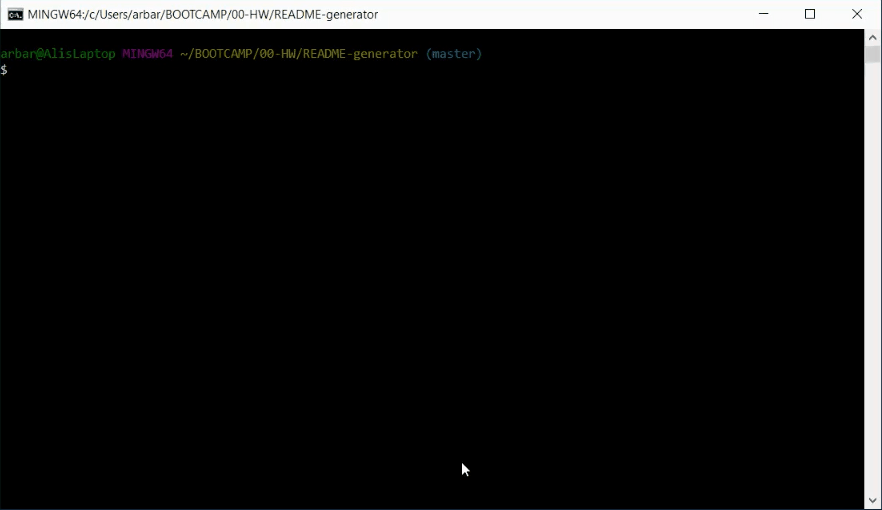
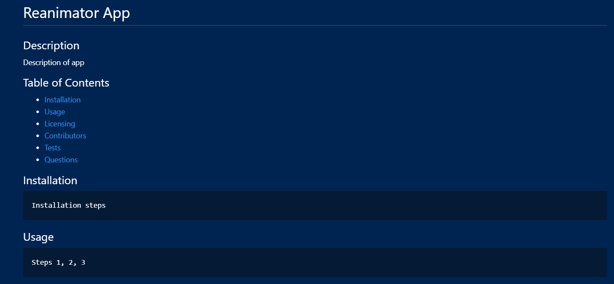
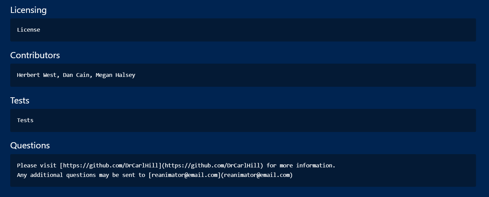

# README Generator

## Description
  When creating an open source project on GitHub, it is important to have a strong README with information about the app. This command line application is designed to create a quick and easy generation of a project README. This allows a project creator to focus more time on the finished project and less on creating a quality README.

### App Usage in Command Line

### App Generated README

## Table of Contents
  * [Installation](#installation)
  * [Usage](#usage)
  * [Licensing](#licensing)
  * [Contributors](#contributors)
  * [Tests](#tests)
  * [Questions](#questions)
  
## Installation
* Clone the repo from GitHub to your local machine
* Run npm install in terminal

## Usage
* To use README generator, run [node index.js] in terminal.
* Answer the series of questions regarding your project. **     **Note: Each question will appear one at a time as the previous inquiry is answered.
* Once the questions are completed, the app will generate a README file with the your project information.

## Licensing
MIT
https://opensource.org/licenses/MIT

## Contributors
https://github.com/ARBarber0510

## Tests
[Video](https://drive.google.com/file/d/1VyhBwT2HkbOAXhM9Eky7y3PcyfMJi4Gq/view?usp=sharing) of testing the app.

## Questions
Please visit [ARBarber0510](https://github.com/ARBarber0510) for more information.
Any additional questions may be sent to [arbarber.ab@gmail.com](arbarber.ab@gmail.com)
    